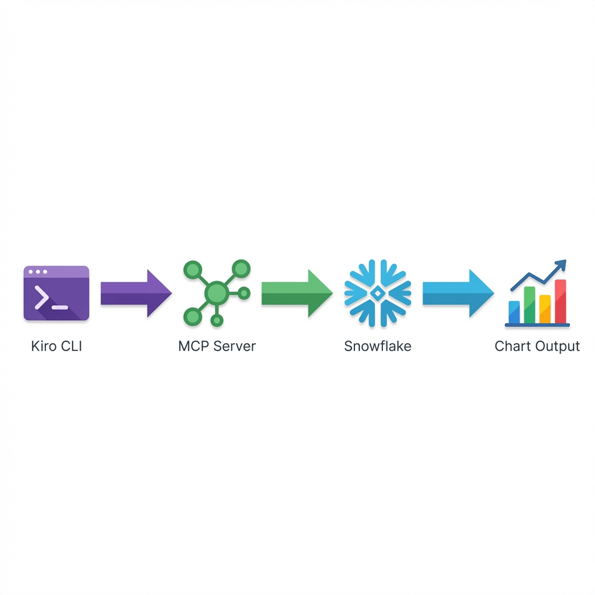

# Snowflake MCP Server with Kiro Integration

[](https://github.com/coleam00/dynamous-kiro-hackathon)
[](https://modelcontextprotocol.io)

**Ask questions in plain English → Get data from Snowflake → See instant charts**

---

## Project Goal

To bridge the gap between business questions and data insights by allowing users to query secure Snowflake data using plain English and instantly receive interactive visualizations.

---

## The Problem

Business users and teams often face friction when trying to get data insights:

- **SQL Barrier:** They don't know how to write complex SQL queries.
- **Time Lag:** Waiting for analysts to generate reports takes time.
- **Visualization Gap:** Getting raw data is often not enough; they need to see trends visually.

---

##  The Solution

This project implements a custom **MCP Server** that connects Kiro CLI to Snowflake:

1. **Understand:** Kiro translates natural language into optimized SQL.
2. **Secure:** Queries are executed against curated **GOLD** views to ensure security and data quality.
3. **Visualize:** When you request a chart, the server generates interactive **Chart.js** visualizations that open instantly in your browser.

---

## How It Works



Instead of writing SQL, you just ask:

> "Show me sales by category"

The server:
1. Translates your question to SQL
2. Queries the Snowflake GOLD views
3. Returns the data in plain English

Then if you want a visualization:

> "Create a bar chart of this data"

A chart opens instantly in your browser.

---

## Quick Start 

### Step 1: Clone & Install
```bash
git clone https://github.com/MrJohn91/Snowflake-MCP-Server-with-Kiro-CLI-Integration.git
cd Snowflake-MCP-Server-with-Kiro-CLI-Integration
uv sync
```

> **Note:** Since you don't have my Snowflake credentials, the server automatically uses **mock data** that mirrors the real production schema.

### Step 2: Test with Kiro

1. **Open Kiro:**
   ```bash
   kiro .
   ```
   *(Kiro automatically detects the MCP configuration)*

2. **Find the chat panel** in Kiro (sidebar or Cmd+L)

3. **Ask questions:**
   - "What views are available?"
   - "Show me sales data by category"
   - "Create a bar chart of revenue"
   - "Describe the DAILY_SALES_SUMMARY view"

---

## MCP Tools

| Tool | What It Does |
|------|--------------|
| `snowflake_list_views` | Lists available views in the GOLD schema |
| `snowflake_describe_view` | Shows columns and data types for a view |
| `snowflake_query` | Executes SQL queries against Snowflake |
| `create_chart` | Generates Chart.js visualizations |

---

## Project Structure

```
├── src/
│   ├── main.py           # MCP server & tool definitions
│   ├── tools/            # Snowflake query logic
│   ├── visualize.py      # Chart generation
│   ├── config.py         # Configuration & mock mode
│   └── mock_data.py      # Simulated data for testing
├── charts/               # Generated chart files
├── skills/               # AI Best Practice Guides
├── .kiro/                # Kiro configuration
│   ├── steering/         # Product context & architecture docs
│   ├── prompts/          # Workflow prompts
│   └── settings/         # MCP configuration
├── tests/
│   ├── test_cli_mock.py  # Automation CLI test script
│   └── test_manual.py    # Interactive test runner
├── README.md
```

---

##  Mock Mode (How It Works)

When you don't have Snowflake credentials (no `.env` file), the server automatically:

1. Detects missing credentials
2. Enables **Mock Mode**
3. Returns realistic sample data that matches the real schema

This lets you test the full workflow without needing database access.

**Mock Data Includes:**
- 2 Views: `DAILY_SALES_SUMMARY`, `CUSTOMER_PRODUCT_AFFINITY_MONTHLY`
- 5 Product Categories: Electronics, Garden, Food, Home, Clothing
- Revenue data for chart generation

---

## Acknowledgments

This project used the [MCP Skill Builder](skills/mcp-builder-skill.md) from Anthropic to ensure high-quality, compliant MCP server implementation.

---

## Troubleshooting

**Kiro doesn't see the MCP server?**
- Make sure you launched Kiro from the project root folder (where `.kiro` exists)
- Restart Kiro after changing the config

**Tests fail with MFA error?**
- This happens when real credentials exist. The test script forces mock mode, so this shouldn't occur with `test_mcp_cli.py`

**Chart doesn't open?**
- Check the `charts/` folder for generated HTML files
- Open them manually in your browser

---

## Built For

Dynamous Kiro Hackathon 2026 - Demonstrating how MCP servers can bridge natural language and enterprise data systems.
